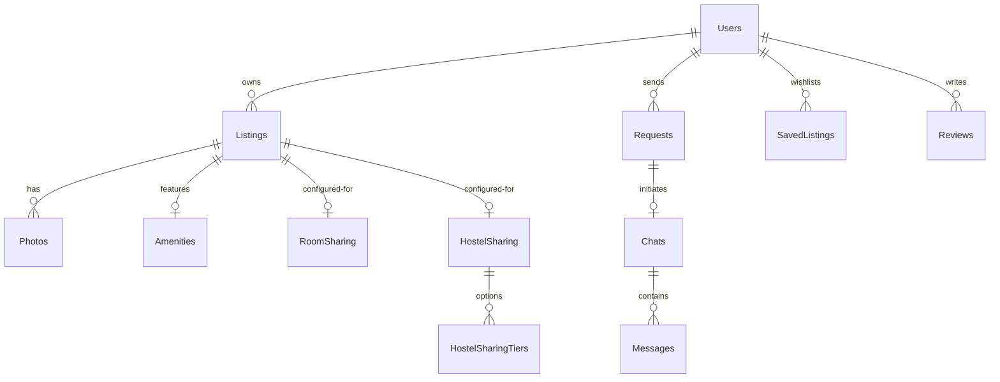

# Roomiee — Complete Product Plan & Documentation

Roomiee is India's easiest platform to find rental houses, hostels, paying guest (PG) accommodations, roommate share listings, and manage listings for property owners.

---

## Goal & Mission

- **Find Rental Houses:** Browse and list entire apartments or houses for rent.
- **Find Roommates:** Connect with other individuals looking for room sharing options.
- **Hostel/PG Accommodations:** Browse/list hostels with multiple sharing options and pricing tiers.
- **Trust & Reviews:** Build feedback loops between owners and tenants using ratings and reviews.
- **Safe Communication:** Unlocked in-app real-time chat once requests are accepted.
- **Facility Discovery:** Interactive mapping showing nearby schools, hospitals, metro stations, gyms, etc.
- **AI Search:** Search properties using natural language query parsing (powered by LLM).
- **Abuse Reporting:** Simple moderation mechanism for flagging fake listings or scams.

---

## Tech Stack

### Frontend
- **React (v19.2.7):** Core library for component-based rendering.
- **Vite (v8.1.1):** Build tool and fast local dev server.
- **React Router DOM (v7.18.1):** Client-side navigation.
- **TanStack React Query (v5.101.2):** Server-state caching and synchronization.
- **Tailwind CSS (v3.4.19):** Utility-first styling framework.
- **Axios (v1.18.1):** HTTP requests with interceptors.
- **Socket.io-client (v4.8.3):** Real-time web socket messaging.
- **Leaflet & MapLibre GL JS:** Interactive map widgets and layers.
- **Lucide React (v1.24.0):** Clean SVG icons.
- **react-hot-toast:** Easy visual toasts.

### Backend
- **Node.js & Express (v5.2.1):** Server runtime and REST framework.
- **Prisma (v6.19.3):** Modern database ORM.
- **PostgreSQL:** Primary relational database (hosted via Supabase or Neon).
- **Socket.io (v4.8.3):** Real-time web socket server.
- **jsonwebtoken (v9.0.3):** Standard authentication via access and refresh tokens.
- **bcryptjs (v3.0.3):** 12-round password hashing.
- **Cloudinary (v1.41.3):** Image hosting, resizing, and optimizations.
- **web-push (v3.6.7):** VAPID-based push notifications for PWAs.

### AI Search & Intelligence
- **OpenRouter API:** Harnesses free LLM endpoints (e.g. `mistralai/mistral-7b-instruct:free`) to convert plain language into structured filters.
- **Fallback Regex Parser:** A local regex-based engine to handle queries when LLMs are offline (matching cities, BHKs, budget, types, etc.).
- **Query Cache:** Caches AI parsed queries in memory to optimize rate limits.

---

## User Roles & Permissions

### 1. Guest (No Authentication)
- Browse listings, use standard filters, view photos and interactive maps.
- Use AI natural language search box.
- Read reviews and browse host profiles.
- *Cannot:* Chat, save listings to wishlist, send requests, or create properties.

### 2. Tenant
- Everything a Guest can do.
- Save/unsave listings to their wishlist.
- Send rental and room-sharing requests.
- Chat with owners/hosts (unlocked only after a request is accepted).
- Create "Room Sharing" listings to find roommates.
- Sublet or post room shares from accepted bookings.
- Review owners (1-5 stars with comments) and see owner's contact phone number.

### 3. Owner
- Everything a Guest can do.
- List properties of any type: House Rental, Room Sharing, Hostel/PG, or Land Sale.
- Accept or reject incoming requests from tenants.
- Chat with tenants (unlocked once request is accepted).
- Manage listing status (Active, Paused, Rented) and review performance analytics.
- Rate tenants who rent or request listings.

### 4. Admin
- Access the Admin Dashboard dashboard tabs (Overview, Users, Listings, Reports).
- Ban/unban users and verify listings.
- Review flagged content (abuse reports) and update their statuses (Open, Resolved, Dismissed).
- View global analytics (total users, active listings, requests, revenue).

---

## Database Schema Overview

### Table Fields Summary

- **Users:** `id`, `name`, `email`, `phone`, `password` (hashed), `role`, `avgRating`, `profileImage`, `isBanned`, `fcmToken`, `createdAt`.
- **Listings:** `id`, `ownerId`, `title`, `description`, `type` (Enum), `status` (Enum), `rent`, `deposit`, `maintenance`, `address`, `city`, `latitude`, `longitude`, `bedrooms`, `bathrooms`, `areaSqFt`, `furnished`, `availableFrom`, `views`, `createdAt`.
- **Amenities:** `listingId` (unique), `wifi`, `parking`, `washingMachine`, `ac`, `fridge`, `kitchen`, `lift`, `gym`, `security`, `powerBackup`, `waterSupply`, `cctv`.
- **Photos:** `id`, `listingId`, `url`, `publicId` (Cloudinary ID), `isPrimary`, `order`.
- **RoomSharing:** `listingId` (unique), `genderRequired`, `minAge`, `maxAge`, `occupationPref`, `smoking`, `drinking`, `vegOnly`, `petsAllowed`, `currentOccupants`, `totalRooms`.
- **HostelSharing:** `listingId` (unique), `genderRequired`, `minAge`, `maxAge`, `smoking`, `drinking`, `vegOnly`, `petsAllowed`.
- **HostelSharingTiers:** `id`, `hostelSharingId`, `sharingSize`, `price`, `available`.
- **Requests:** `id`, `listingId`, `tenantId`, `status` (PENDING, ACCEPTED, REJECTED), `message`, `createdAt`.
- **SavedListings:** `id`, `userId`, `listingId`.
- **Chats:** `id`, `ownerId`, `tenantId`, `listingId`, `requestId`.
- **Messages:** `id`, `chatId`, `senderId`, `content`, `imageUrl`, `seen`, `createdAt`.
- **Reviews:** `id`, `listingId` (optional), `reviewerId`, `receiverId`, `rating` (1-5), `comment`, `createdAt`.
- **Reports:** `id`, `listingId`, `reporterId`, `reason` (Enum), `details`, `status` (OPEN, RESOLVED, DISMISSED), `createdAt`.
- **Notifications:** `id`, `userId`, `title`, `body`, `type`, `data` (JSON), `read`, `createdAt`.

---

## Key Page Routes

### Public Pages
- `/` - **Home Page:** Hero search, city quick links, stats, and guides.
- `/search` - **Search Page:** Filter sidebar, results grid, and AI search switcher.
- `/listing/:id` / `/room/:id` / `/hostel/:id` / `/land/:id` - **Details Pages:** Displays photo galleries, amenities, maps, nearby amenities, and owner profiles.
- `/login` & `/register` - **Auth Pages:** Split-screen authentication.

### Dashboards (Protected)
- `/dashboard/tenant` - **Tenant Home:** Wishlists, outgoing request logs, and chat summaries.
- `/dashboard/owner` - **Owner Home:** Listed properties, incoming requests, views/clicks charts.
- `/dashboard/listings/new` - **Listing Creator:** Interactive maps picker, dynamic forms by type.
- `/dashboard/chats` - **Chat Hub:** Conversations threads with unread indicators and active bubbles.

### Administration
- `/admin/*` - **Admin Panels:** Global analytical counts, report resolution controls, and user restrictions.
